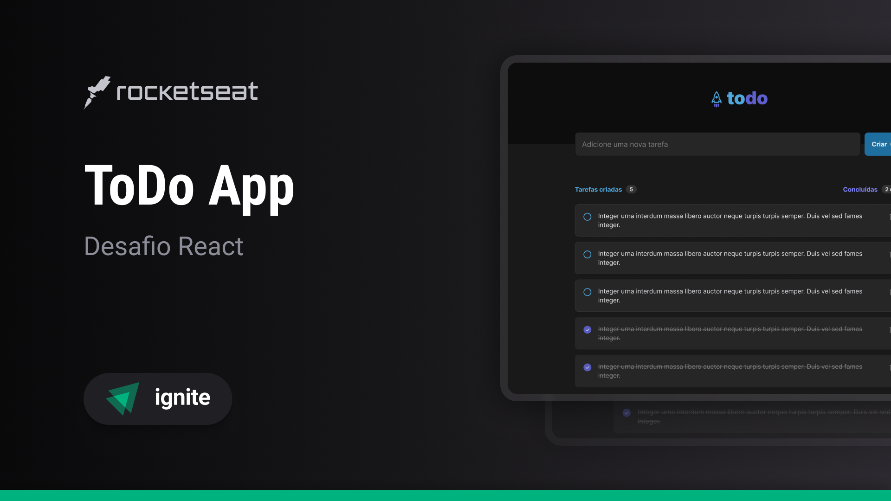

# ToDo App

O **ToDo App** é um projeto simples de **To Do List** desenvolvido com **ReactJS** e **Tailwind CSS**. Permite ao usuário criar, marcar como feita e deletar tarefas. Além disso, exibe o número total de tarefas criadas e quantas foram concluídas. Todas as tarefas são salvas no localStorage, garantindo que a lista de tarefas não seja perdida mesmo após o fechamento do navegador.

## Funcionalidades

- Criação de novas tarefas.
- Marcação de tarefas como concluídas.
- Exclusão de tarefas.
- Exibição do número total de tarefas e quantas foram concluídas.

## Como Usar

1. Acesse o [ToDo App](https://to-do-list-0kira-vgl.vercel.app/) em seu navegador.
2. Na página inicial, insira uma nova tarefa no campo de entrada e pressione Enter.
3. Marque as tarefas como concluídas clicando no checkbox ao lado esquerdo de cada uma.
4. Exclua tarefas clicando no botão de lixeira ao lado direito de cada uma.

## Persistência de Dados

Todas as tarefas criadas são salvas no localStorage do navegador. Isso significa que mesmo após fechar o navegador, suas tarefas ainda estarão lá quando você retornar ao aplicativo.

## ToDo App

